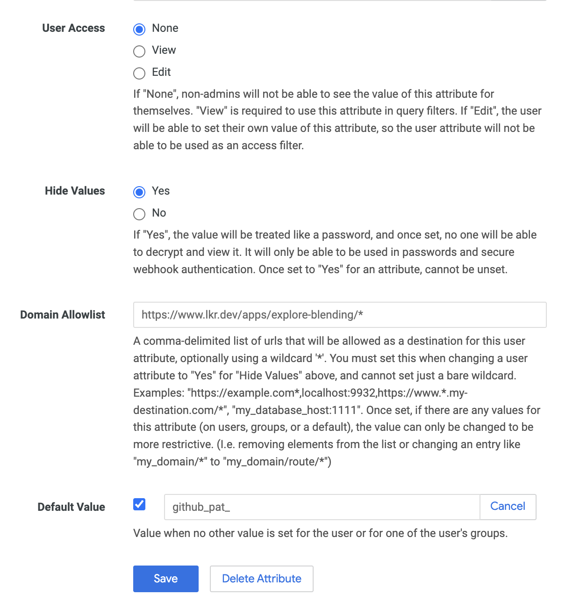
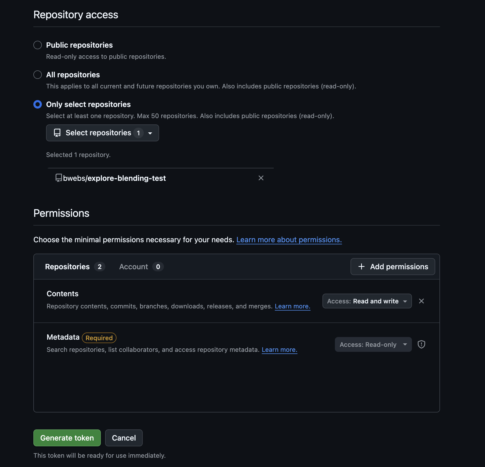

# Explore Blending

The Explore Blending application is an early version of a Looker extension that allows explore users to blend explores, choose join paths, and perform custom calculations (custom dimensions, custom measures, and table calculations) on the result. It's an alternative version of merge results that lets an end user do joins on the full explore queries. Explore Blending enables you to combine any number of Looker Explore questions in the database. It's like merging results beyond just a simple in-memory engine. There are two main modes: SQL and LookML. We highly recommend using the LookML mode, as it provides the most functionality; however, any user with SQL Runner access can test it using the SQL model.

## Try it Now

-   If you have `sql_runner` permissions in Looker, you can test this extension with no configuration. Add this to any `manifest.lkml` file within any of your LookML projects

```
application: explore_blending {
  label: "Explore Blending (alpha)"
  url: "https://cdn.lkr.dev/apps/explore-blending/latest/bundle.js"
  file: "bundle.js"
  entitlements: {
    local_storage: yes
    navigation: yes
    new_window: yes
    use_form_submit: yes
    use_embeds: yes
    use_clipboard: yes
    core_api_methods: [
      "me",
      "session",
      "all_lookml_models",
      "query",
      "lookml_model_explore",
      "run_query",
      "create_sql_query",
      "run_sql_query",
      "query_for_slug",
      "search_dashboards",
      "create_dashboard_element",
      "connection",
      "dashboard",
      "all_connections",
      "artifact",
      "update_artifacts",
      "session"
    ]
    external_api_urls: [
      "https://www.lkr.dev/apps/explore-blending/api"
    ]
  }
}
```

## How it works

### SQL Mode

Looker has two endpoints `create_sql_query` and `run_sql_query` which are used in tandem. Once a sql query has been run, you can Explore it like you do in the Looker UI. So SQL Mode takes all the explore queries and the adhoc joins and puts them into a single sql query. Once the new SQL query is created, it creates and runs a new sql query and the results are explored. These results can then use the user interface to add onto a dashboard.

### LookML Mode

LookML Mode takes all the explore queries and the adhoc joins and puts them into a single LookML view object and with an explore object. Once the new LookML file is created, it is saved to the LookML model and can be explored like any other explore. In order to use this mode, you must

1. Provide the Github repository where the LookML files are stored
2. The name of the project that will house the new LookML files and is attached to the Github repository
3. Configure user attributes for a Github Personal Access Token (Classic) or Fine grained token and your Looker project's webhook deploy secret.

## Use cases

-   Advanced Segmenting like users who ordered the top 10 product last week. Create an explore query that finds the top 10 products. Create a second explore query that selects user details and all their purchases last week. Inner join the two queries together

## Built-in Extension Settings

## Use LookML

## Configure Required

## Querying Across Models

### Access Grants

API Credentials required

-   Recommended to use the Hide Values yes with the API credential, user attributes, and a domain allowlist
-   -   `https://www.lkr.dev/apps/explore-blending/*` or https://your.override.api/*

## Hosting this yourself

## Securing your user attribute secrets
The application can be setup with several secrets (Deploy Webhook, Github Personal Access Token, and Looker Client Id/Secret). It is recommended when setting up the extension and the user attributes, to use the settings:

- User Access: None
- Hide Values: Yes
- Domain Allowlist: `https://www.lkr.dev/apps/explore-blending/*` or https://your.override.api/*

This will ensure that the secrets can not be exposed by anyone besides the URLs they are being sent to.



## Github
### Fine grained token

If using a fine grained token, at a minimum make sure you have the following scopes enabled

- Repository Metadata (Read)
- Repository Contents (Read & Write)



## Versioning

If you are using the lkr.dev blend_api (happens by default), but want to pin yourself to a particular version of the frontend and backend, you can use a JavaScript URL in your manifest of a specific version of the extension and an `override_api` in your config.

### Using override API
